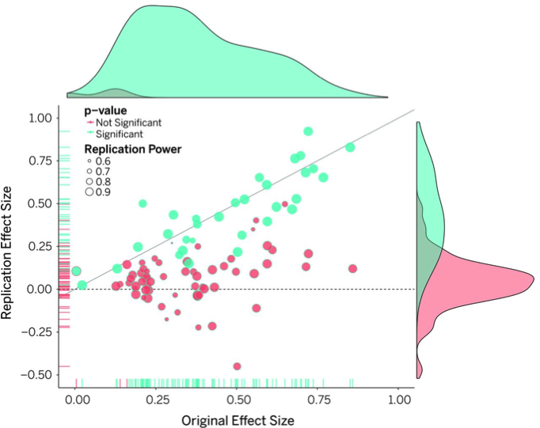
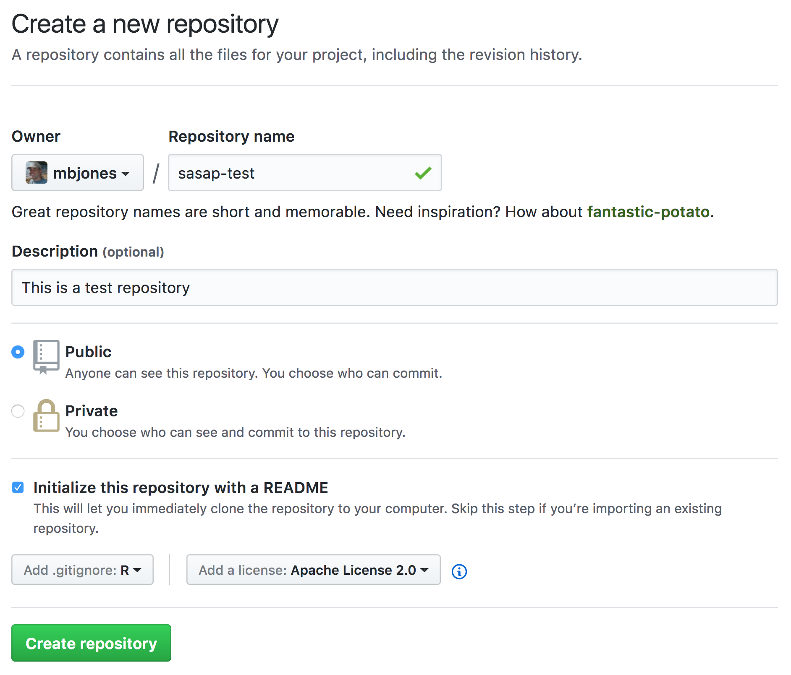
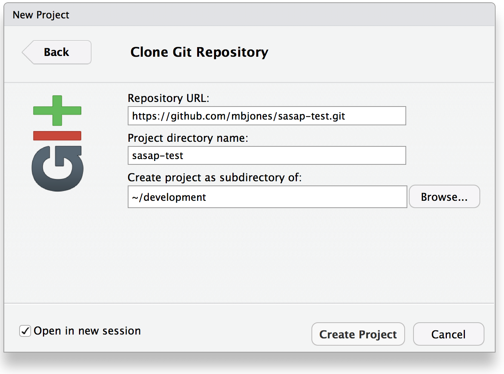
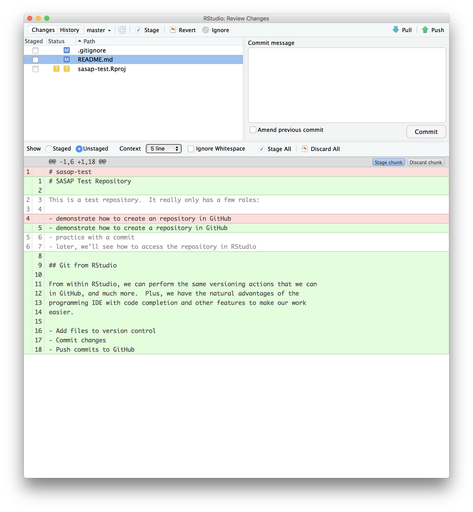
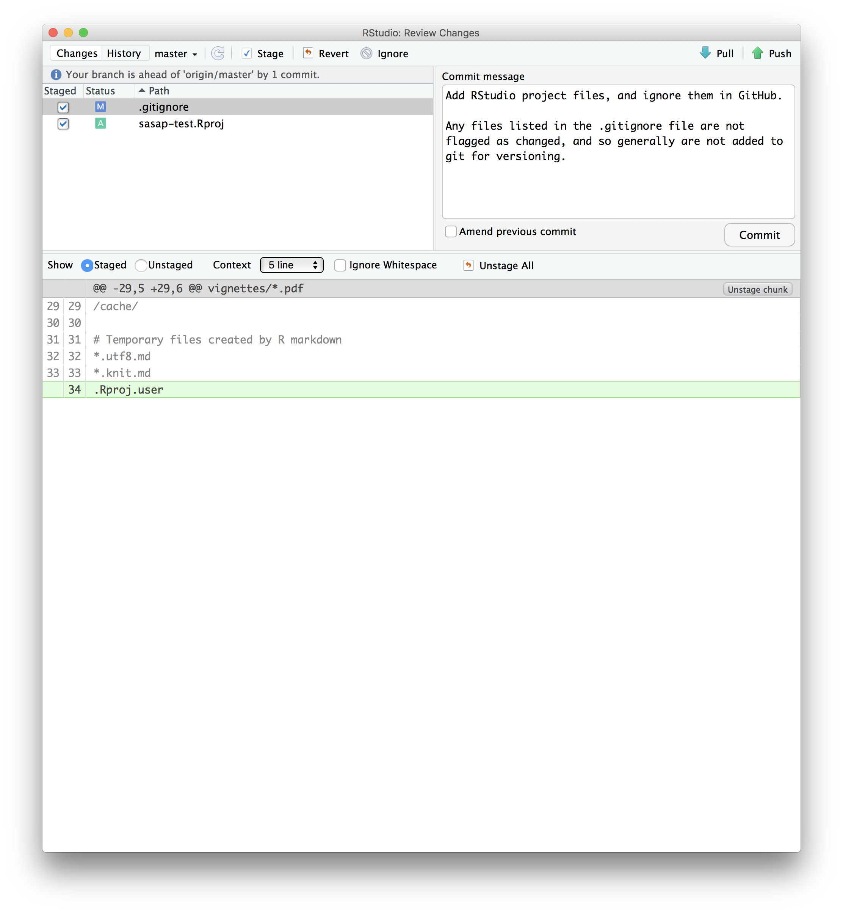

_**Reconocimiento**_: Gran parte de los documentos introductorios son una traducción libre desde al material preparado 
y compartido por el grupo [SASAP](https://alaskasalmonandpeople.org/) del [NCEAS](https://www.nceas.ucsb.edu/) en su sitio [SASAP-Training](https://github.com/NCEAS/sasap-training) de en [GitHub](https://github.com/).


# Introducción

La reproducibilidad es fundamental en la ciencia, ya que la ciencia está basada en observaciones empíricas acopladas a modelos 
explicativos. Si bien la reproducibilidad incluye el ciclo de vida completo de la ciencia y además incluye aspectos como la 
consistencia metodológica y tratamiento del sesgo, en este curso nos enfocaremos a la **reproducibilidad computacional**, esto
es la habilidad para documentar datos, análisis y modelos en forma suficiente para que otros investigadores sean capaces de 
entender, reproducir y re-ejecutar los pasos computacionales que nos permitieron llegar a los resultados y sus conclusiones. 

## La crisis de reproducibilidad

@ioannidis_why_2005 destacó la crisis en reproducilidad de la ciencia cuando escribió que "La mayoría de los 
descubrimientos son falsos para la mayoría de los diseños de investigación, en la mayoría de las áreas de investigación" 
(_"Most Research Findings Are False for Most Research Designs and for Most Fields"_). Ioannidis indica la formas en que 
el proceso de investigación ha inflado los efectos de los tamaños muestrales y los tests de hipótesis que codifican los 
sesgos existentes. Investigaciones posteriores han confirmado que la reproducibilidad es baja para muchos campos de la
ciencia, incluyendo genética [@ioannidis_repeatability_2009], ecología [@fraser_questionable_2018], y psicología
[@open_science_collaboration_estimating_2015], entre muchas otras. Por ejemplo, el efecto del tamaño de muestra en la psicología
se ha mostrado que decrece significativamente cuando se repiten los experimentos (fig. \@ref(fig:effectsize)).

```{r effectsize, echo=FALSE, out.width = '100%', fig.align = 'center', fig.cap = 'Efecto del tamaño de muestra descrese en experimentos repetidos (Open Sieze Collaboration 2015).'}

```

## Reconocimientos

Este curso está basado en el desarrollado por el [_Arctic Data Center_](https://arcticdata.io/) en 
[_NCEAS_](http://www.nceas.ucsb.edu) y ha sido modificado y traducido por [Jorge Cornejo-Donoso](https://orcid.org/0000-0002-4244-2865).


Antes de comenzar con el material para la investigación reproducible, es necesario que 
aprendamos sobre algunas herramientas fundamentales, como son RStudio, Git/Github y con 
posterioridad comenzaremos a trabajar con _RMarkDown_.

# Investigación reproducible: ¿De qué estamos hablando?

## Objetivos

En este capítulo veremos:

- En qué consiste la reproducibilidad computacional y por que es útil e importante. 
- La importancia del control de versiones para la reproducibilidad computacional.
- Cómo verificar que el ambiente de RStudio está configurado adecuadamente para el análisis.
- Cómo configurar _git_.

## Investigación reproducible

Las reproducibilidad es fundamental en la ciencia, que a su vez se basa en observaciones 
empíricas con las 
que se construyen o define modelos explicativos.  
La reproducibilidad por su parte, envuelve todo el ciclo de vida de la ciencia,
incluyendo aspectos como la 
consistencia metodológica y el tratamiento del sesgo. En este curso nos vamos a enfocar en la 
**reproducibilidad computacional**, entendiendo esto como la habilidad de documentar datos, análisis y 
modelos con la suficiente información para que otros investigadores sean capaces de entender e
idealmente reproducir, paso a paso, el proceso que no a los resultados y conclusiones de nuestra
investigación.

### ¿Qué es necesario para la reproducibilidad computacional?

El primer paso para abordar este problema es ser capaz de evaluar los datos, análisis y modelos con los
que se sacan las conclusiones.  Considerando cuales son las prácticas más comunes, esto resulta bastante 
difícil ya que la generalidad de los datos no se encuentran disponibles, la sección sobre la metodología
de los informes y papers no describe en detalle las aproximaciones computacionales utilizadas o los 
análisis y además los modelos son generalmente realizados en programas gráficos o, cuando se usan 
ambientes tipo script, el código no se hace disponible.

Sin embargo todos estos inconvenientes pueden ser fácilmente solucionados. Los investigadores pueden 
lograr la reproducibilidad computacional con aproximaciones basada en las aproximaciones de 
_ciencia libre_ (open science), siguiendo pasos simples para archivar y publicar (libremente) los datos
y códigos fuentes utilizados, describiendo el flujo de trabajo y permitiendo de esta forma trazabilidad
de los resultados (ej.:, @hampton_tao_2015, @munafo_manifesto_2017).

### Conceptualizando los flujos de trabajo (workflows)

El flujo del trabajo científico encapsula todos los pasos desde la 
adquisición de los datos, limpieza, transformación, integración, análisis y 
visualización.  

```{r workflow, echo=FALSE, out.width = '100%', fig.align = 'center', fig.cap = 'Captura de un flujo de trabajo científico y procedencia de múltiples pasos necesarios para reproducir un resultado científico desde los datos crudos.'}
knitr::include_graphics("images/2.1_workflow.png")
```

Una representación del flujo de trabajo puede variar desde simples diagramas de flujo (fig. 
\@ref(fig:workflow)) a códigos totalmente ejecutables. Códigos de R y python son una forma literal de 
plasmár el flujo de trabajo lo que cuando son publicados por investifacores, como versiones 
específicas del código y los datos asociados, permite la repetibilidad de sus cómputos en forma simple
y de esta forma entender la procedencia de las conclusiones.


# RMarkdown

## Objetivos

En este capítulo veremos:

- RMarkdown.
- Introducción a las funciones básicas incluidas en RStudio
- Como usar las páginas de ayuda.

## Introducción

Ahora que ya conoce un poco de la sintaxis básica de R, podemos comenzar a aprender sobre RMarkdown.
La experiencia nos dice que te vas a volver loco haciendo los análsis o modelos en los cuales trabajes 
y vas a fallar en generar un flujo de trabajo reproducible. Peor aún, si tratas de desarrollar código
directamente en la consola de R. RMarkdown es realmente clave para la investigación colaborativa, 
es por esto que vamos a comenzar rapidamente a aprender como usarlo y lo seguiremos uasndo durante
el resto del curso.

Un archivo de RMarkdown nos va a ayudar a _tejer_ un texto _markdown_ con fragmentos de código de R
que es evaluado y cuyas salidas, como tablas y gráficos, son incluidas en el documento final.

Para abrir un nuevo documento de RMarkdown siga los siguiente pasos:

File -> New File -> RMarkdown... -> Document of output format HTML, OK.


```{r RStudioNew, echo=FALSE, out.width = '75%', fig.align = 'center', fig.cap = 'Captura de pantalla de la interfase para la creación de un proyecto nuevo de RStudio.'}
knitr::include_graphics("images/5.1_rstudio_new-rmd-doc-html.png")
```

Le puede dar un título como "Mi Proyecto". Luego clic en OK. 

OK, primero que todo: Al abrir el archivo, vamos a ver un 4° panel de la consola de RStudio, este panel
es un editor de texto que nos permite abrir varios archivos en un único panel.

Ahora démosle una mirada a este archivo que acabamos de crear - a primera vista se puede ver que no
está en blanco; hay un texto inicial que se entrega por defecto. Hay algunas cosas que podemos
identificar en el texto: 

- Está en inglés (no se preocupe, ¡lo vamos a reescribir!)
- Hay secciones en con texto con el fondo blando y el código R está en secciones plomas (por defecto,
estos colores del fondo se pueden cambiar). 

```{r rmarkdown, echo=FALSE, out.width = '100%', fig.align = 'center', fig.cap = 'Imagen con el código fuente de un archivo RMarkdown.'}
knitr::include_graphics("images/5.2_rmarkdown.png")
```

<br>
Lo primero que vamos a hacer es generar el código HTML (Knit HTML) haciendo clic en la pelota de lana
azul en la parte superior del panel con el archivo RMarkdown. Cuando haga clic por primera vez en este 
botón, RStudio pedirá que guarde el archivo. Cree un nuevo directorio en algún lugar que le sea fácil 
encontrarlo posteriormente (por ejemplo Escritorio o Mis Documentos),  dele un nombre que tenga sentido
y le permita recordarlo después (ej: `clase_rmarkdown`).
<br>

```{r rmarkdownSideSide, echo=FALSE, out.width = '100%', fig.align = 'center', fig.cap = 'Imagen con el código fuente y pagina resultante de un archivo RMarkdown.'}
knitr::include_graphics("images/5.3_rmarkdown_side_by_side.png")
```

¿Que cosas puede notar entre al comparar los dos archivos? 

Las **secciones de código R** plomas están rodeadas de 3 tics y `{r LABEL}`. Estas secciones son 
evaluadas por R, generando una salida de texto en el caso de  `summary(cars)` y de un gráfico en el
caso de `plot(pressure)`.

Note como el código `plot(pressure)` no se muestra en la salida HTML porque la sección de código 
R tiene la opción `echo=FALSE`.

Algunos otros detalles...

Este archivo de RMarkdown tiene 2 lenguajes incluidos: **R** y **Markdown**. 

Aun no sabemos mucho de R, pero ya puede ver que estamos tomando el resumen de los datos llamados
'cars' y luego los graficamos. Hay mucho más para aprender sobre R y vamos a trabajar eso en las
próximas clases.

El segundo lenguaje que incluye el archivo es Markdown. Este es un lenguaje que para dar formato
a texto plano y tiene aproximadamente 15 reglas para conocer.

Vea la siguiente sintaxis:

- **Títulos**: son procesados en múltiples niveles con: `#`, `##`
- **Negrita**: `**palabra**`

Hay muchas tablas de consejos [cheatsheets](https://github.com/adam-p/markdown-here/wiki/Markdown-Here-Cheatsheet)
que te puede utilizar para obtener ayuda, una de esas está incluida en RStudio: para abrirla vaya
a Help > Markdown Quick Reference

**Importante**: El símbolo de gato, número o para los milenials hashtag `#` tiene un 
significado diferente al que reconoce R cuando es usado en Markdown: 

- en R, un gato indica que es un comentario y no será evaluado. Se pueden usar tantos como se quiera:
`#` es equivalente a `######`. Es sólo una cuestión de estilos.
- en Markdown, un gato indica el nivel del título. Y cuantos use tienen un efecto: `#` es un "título
nivel 1", lo que significa que es la fuente de mayor tamaño y que está al tope de la jerarquía. 
`###` es un título nivel 3 y se muestra anidado bajo el título `#` y `##`.

Más sobre esto en: http://rmarkdown.rstudio.com/

### Actividad

1. En Markdown, escriba un texto en cursiva (Itálica) y haga una lista numerada. Luego agregue algunos
subtítulos. Use la Referencia de Uso Rápido de Markdown (en barra del menú: Help > Markdown Quick 
Reference). 
1. Haga clic en Knit para general el archivo html. 

### Secciones del código {#ejecutarCodEnRmd}

OK. Ahora practiquemos con algunos comandos de R.

Cree una nueva sección en en su RMarkdown siguiendo alguno de estos pasos:

- Clic "Insert > R" en la parte superior del panel de edición.
- Escriba a mano 
   \```{r}
   \```
- Si no ha borrado las secciones por defecto que venían con el archivo, editelas!

Ahora escribamos un poco de código R. 

```
x <- 4*3
x
```

Note que al apretar la tecla Enter el comando no se ejecuta; recuerde que esto es sólo un archivo
de texto. Para ejecutar las secciones de código R (secciones en plomo) se deben enviar a la consola.
¿Cómo se hace eso?

Hay varias formas de hacerlo: 

1. Copiar y pegar los comandos en la consola.
1. Seleccionar la línea (o poner el curso en ella) y hacer clic en 'Run'. Esto está 
disponible desde:
    a. la barra arriba del archivo (flecha verde).
    b. la barra menú: Code > Run Selected Line(s).
    c. combinación de teclas: control-enter en Windows o command-enter en macOS.
1. Clic en la flecha verde en el lado superior derecho de su sección de código.

### Actividad

Agregue otros comandos a su archivo. Ejecútelos de las tres formas indicadas más arriba. Finalmente,
guarde su archivo RMarkdown. 

## Funciones de R

Hasta ahora hemos aprendido la sintaxis básica y conceptos de programación en  R, como navegar
en RStudio y RMarkdown, pero no hemos hecho nada complicado o interesante aún. Aquí es donde las
_funciones_ de R son útiles.

Una función es una forma de agrupar una serie de comandos para desarrollar una tarea en una forma
reusable. Cuando una función es ejecutada, se produce un valor de salida. Nosotros generalmente 
decimos que "llamamos" una función cuando la ejecutamos. Lo interesante sobre las funciones es que
pueden ser creadas por los usuarios y guardadas como un objeto usando el operador de asignación 
('<-'), de esta forma es posible escribir una función para lo que sea que necesitemos. Tenga en 
cuenta que R tiene una colección gigantesca de funciones pre-existentes, las que además son expandibles
con paquetes o librerías. Para comenzar, vamos a usar algunas funciones de R básicas ya incluidas.

Todas las funciones se llaman usando la misma sintaxis: nombre de la función seguido de un paréntesis 
donde se entrega lo que necesite la función para funcionar. Las piezas de información que la función
necesita para hacer su trabajo se conocen como argumentos. De esta forma, la sintaxis para usar 
una función se ve así: `valor_resultante <- nombre_de_función(argumento1 = valor1, argumento2 = valor2, 
...)`. 

### Ejemplo simple

Para tomar un ejemplo muy simple, vamos a utilizar una función que calcula el promedio, `mean()`. 
Como se puede imaginar, esta función calcula el promedio de los números entregados como argumentos. 

Creemos un vector con pesos:

```{r}
peso_kg <- c(55, 25, 12)
```

y ahora usemos la función `mean` para calcular el peso promedio.

```{r}
mean(peso_kg)
```

## Páginas de ayuda

### Obteniendo ayuda

¿Qué pasa ahora si sabe cuál es la función que necesita pero no cómo funciona? Afortunadamente 
RStudio entrega una forma muy fácil para acceder a las páginas de documentación y ayuda.

Para acceder a la ayuda para la función `mean`, entre el siguiente comando en la consola:

```{r, eval = F}
?mean
```

Esto abrirá el panel de ayuda en la sección inferior derecha de RStudio.

Las páginas de ayuda están dividas en secciones, la documentación está en inglés:

 - _Description_: Se entrega una descripción extendida de lo que hace la función.
 - _Usage_: Los argumentos de la función y sus valores por defecto.
 - _Arguments_: Una explicación de los datos que cada argumento espera.
 - _Details_: Detalle que sean relevantes de conocer.
 - _Value_: Los resultados devuelve la función.
 - _See Also_: Otras funciones que podrían resultar útiles en este contexto.
 - _Examples_: Algunos ejemplos de como usar la función.


### Actividad

> Ejercicio: Hable con su(s) compañero(s) y dele una mirada a las ayudas de algunas  funciones 
que usted espera que existan. Aquí les dejo algunas ideas: `?getwd()`, `?plot()`,  `min()`, 
`max()`, `?log()`.

También existe ayuda para cuando usted no está seguro del nombre de la función, en esos casos 
solo es necesaroio usar doble símbolo de pregunta:

```{r, eval=F}
??install 
```

No todas las funciones tienen (o requieren) argumentos:

```{r}
date()
```

## Leyendo un archivo de datos a R

Hasta ahora hemos aprendido como asignar valores a objetos de R y lo que es una función, pero no
hemos hecho nada aún con datos reales. Ahora vamos a introducir la función `read.csv`, que nos permite
cargar a R datos reales desde un archivo CSV. Esta función se usa generalmente en las primeras líneas
del código que escribamos. 

Ya que esta será nuestra primera vez usando esta función, primero leeremos la página de ayuda de 
`read.csv`. La ayuda tiene mucha información, mostrando que la función acepta muchos argumentos, sin 
embargo el primero de ellos es el más importante - tenemos que decirle que archivo es el que va a leer. 

### Descargue un archivo desde el Arctic Data Center

Navegue al set de datos de Craig Tweedie  @tweedie_2009 que está publicado en el Arctic Data Center y 
descargue el primer archivo _csv_ llamado "BGchem2008data.csv". Mueva este archivo desde su carpeta de 
Descargas a un directorio de fácil acceso. Yo recomiendo crear un directorio llamado `datos` en el 
directorio que creó anteriormente para las otras actividades de esta clase.

Ahora tenemos que indicrle a la función `read.csv` como encontrar el archivo que queremos leer. Para 
esto se usa el argumento `file` (archivo) que se puede ver en la sección usage (uso) de la página 
de ayuda. En RMarkdown, se pueden usar path absolutos (que comienzan con su directorio `~/`) o path 
relativos, que son **relativos a la ubicación del archivo RMarkdown**. RStudio y RMarkdown tiene la 
capacidad de autocompletar cuando se usan paths relativos, por lo que usaremos ese sistema. Asumiendo 
que ya movió el archivo a el directorio dentro de la carpeta `archivos_clase_R` llamada `datos`, su 
función `read.csv` puede ser llamada de la siguiente forma:

```{r, eval = F}
bg_chem <- read.csv("datos/5.1_BGchem2008data.csv") 
## El nombre fue cambiado para hacer referencia que el archivo csv se usa en el capítulo 5.
```

Ahora debería tener un objeto en R llamado `bg_chem` de la clase `data.frame` en su ambiente de 
trabajo. Verifique `data.frame` existe y contiene los datos.

Note que en las páginas de ayuda hay una gran cantidad de argumentos que no fueron necesarios de 
utilizar. Algunos argumento en las llamadas a funciones son opcionales y algunos otros son requeridos. 
Los argumentos opcionales son  mostrados en la sección de uso como un par `nombre = valor`, donde se 
muestra el valor que usa esa opción por defecto. Si usted no especifica el valor para la oción en 
particular, la función asume el valor por defecto (ejemplo: `header = TRUE` para `read.csv`). Los 
argumentos requeridos sólo muestran el nombre del argumento, sin un valor asociado. Fíjese que el 
único argumento requerido para `read.csv` es `file`.

Siempre se puede especificar un argumento de la forma `nombre = valor`. Pero si no lo hace, R intentará
identificarlos basado en el orden en que fueron entregados. De esta forma, en el comando de más arriba,
se asume que queremos `file = "data/5.1_BGchem2008data.csv"`, ya que _file_ es el primer argumento. 
Si queremos agregar algún otro argumento, por ejemplo `stringsAsFactors`, vamos a necesitar especificarlos 
usando `nombre = valor`, ya que el segundo argumento es `header`. Para las funciones que llamo comúnmente, 
uso esto sólo para los primeros 2 argumentos, para los que están en la 3a posición 
o más alla siempre uso el par `nombre = valor`.

Muchos usuarios de R (incluyéndome) sobrescriben el argumento por defecto de `stringsAsFactors` usando
la siguiente llamada:

```{r}
bg_chem <- read.csv("data/5.1_BGchem2008data.csv", stringsAsFactors = FALSE)
```

Esto muy útil, ya que de otra forma las columnas que contiene datos tipo strings son transformados a 
factores, pudiendo generar esto problemas y confusiones.

## Usando `data.frames`

Un `data.frame` en R es una estructura de datos de dos dimensiones, es similar a como se comporta una
hoja de cálculos. Un `data.frame` es una colección de filas y columnas de datos, donde cada columna 
tiene un nombre y representa una variable, siendo cada fila a una medición de esa variable. De esta 
forma, cuando ejecutamos `read.csv`, el objeto `bg_chem` fue creado como un objeto tipo `data.frame`. 
Hay muchas formas para explorar un `data.frame` en R y RStudio. A continuación mostramos algunos:

- Clic en la palabra `bg_chem` en el panel _Environment_.
- Clic en la flecha junto a `bg_chem` en el panel de _Environment_
- Ejecute `head(bg_chem)` en la consola.
- Ejecute `View(bg_chem)` en la consola.

Usualmente las funciones se ejecutan en columnas individuales de un `data.frame`. Para llamar a una
columna específica se usa el operador `$`. Por ejemplo, digamos que se quiere mirar las primeras filas 
sólo de la columna `Date`. Para esto se debe ejecutar en la consola:

```{r}
head(bg_chem$Date)
```

¿Cómo se puede calcular la temperatura promedio de las muestras tomadas por el CTD?

```{r}
mean(bg_chem$CTD_Temperature)
```

O si quisiéramos guardar este promedio como una variable para ser utilizada después:

```{r}
temp_promedio <- mean(bg_chem$CTD_Temperature)
```

También es posible crear algunos gráficos simples utilizando este operador (`$`).

```{r}
plot(bg_chem$CTD_Depth, bg_chem$CTD_Temperature)
```

En R existen muchas herramientas y funciones más avanzadas para crear mejores gráficos 
(incluso con una sintaxis más simple). Veremos algunas de ellas en capitulos posteriores.

### Actividad

> Ejercicio: Tome algunos minutos en explorar este set de datos. Pruebe algunas 
funciones en las columnas utilizando el operador `$` para seleccionar una columna
única. Experimente haciendo gráficos y generando resúmenes de los datos. 

## Solución de problemas

### Mi RMarkdown no genera (knit) el PDF

Si se obtiene un error cuando se trata de generrl el PDF, donde dice que su computador no tiene la 
instalación de LaTeX, existen dos posibles problemas:

1. Su computador no tiene LaTeX instalado.
1. Su computador si tiene LaTeX instalado, pero RStudio no lo puede encontrar (no está definida la ruta
o path).

Si usted ya usa LaTeX (para escribir papers por ejemplo), seguro que su problema esté en la segunda
categoría. Arreglar esto sólo requiere redireccionar RStudio a donde este instalado LaTeX, pero esto
no lo explicaremos acá.

Si su problema es que no tiene instalado LaTeX y **está seguro que no lo tiene**! puede usar el paquete
de R `tinytex`, este se instala muy fácilmente y es reconocido automáticamente por RStudio. Para hacer
esto sólo necesita tener derechos de administrador del computador.

Para instalar `tinytex` ejecute en la consola:

```{r, eval = F}
install.packages("tinytex")
tinytex::install_tinytex()
```
<!---
 Si se genera un error como `destino /XXX/XXX/ sin permisos de escritura`, solo necesita
dar los permisos de escrita a este directorio (y esto solo se puede hacer con permisos de 
administrador). To do this, run this command in the terminal:


    sudo chown -R `whoami`:admin /usr/local/bin

and then try the above install instructions again. More information about `tinytex` can be found [here](https://yihui.name/tinytex/)

--> 

### Acabo de ejecutar un comando pera no pasa nada

Esto puede ocurrir porque no completó el comando: ¿Se muestra un pequeño signo `+` en su consola?
R le esta diciendo que está esperando a que termine de entregar los comandos. En el ejemplo de más
abajo falta cerrar el paréntesis.

```{r, eval=FALSE}
> x <- seq(1, 10
+ 
```

Se puede simplemente cerrar el paréntesis y apretar enter, o `esc` dos veces, lo que va a cancelar cancelar
la ejecución del comando.

### R dice que mi objeto no puede ser encontrado

Este error es muy común en usuarios nuevos: `Error in mean(myobject) : object 'myobject' not found`

Esto significa que el objeto llamado `myobject` no existe en el ambiente de trabajo. Las razones más 
comunes para este error son:

- **Error de tipeo**: asegúrese que el nombre de su objeto esta bien escrito, R hace diferencias
entre mayúsculas y minúsculas. Debe estar escrito _exactamente_ como fue creado.
- **No fue asignado a una variable**: note que los objetos sólo son guardados en el ambiente de trabajo
si fueron asignado con el operador de asignación, ej: `myobject <- read.csv(...)`.
- **No ejecute la linea en RMarkdown**: recuerde que escribir una línea de código en RMarkdown no es lo
mismo que escribirla en la consola, usted tiene que ejecutar la línea de código usando _control + enter_,
ejecutando la sección de código o por alguna de las otras formas que fueron descritas en la sección \@ref(ejecutarCodEnRmd) de este mismo capítulo.

## Análisis literal

RMarkdown es una excelente forma de generar análisis literales y flujos de trabajo reproducibles. [Aquí](https://nceas.github.io/sasap-training/materials/reproducible_research_in_r_fairbanks/example-brood-table-analysis.html) hay un ejemplo en inglés de un flujo de trabajo real escrito utilizando RMarkdown.


# Control de versiones con git y GitHub

## Objetivos

En este capítulo veremos:

- ¿Por qué __git__ es útil para análisis reproducibles?
- ¿Cómo usar __git__ para registrar los cambios que se hacen en el tiempo?
- ¿Cómo usar __GitHub__ para colaborar?
- ¿Cómo estructurar los "_commits_" para que los cambios sean claros para otros?
- ¿Cómo escribir mensajes de "_commits_" que sean efectivos?

## El problema con los nombres de archivo

```{r finalDoc2, echo=FALSE, out.width = '100%', fig.align = 'center', fig.cap = 'El dilema de usar nombres como descriptor de versiones.'}
knitr::include_graphics("images/3.1_phd_comics_final.png")
```

Cada archivo en un proceso científico sufre de cambios. Los manuscritos son editados. Las figuras son  revisadas. Los 
códigos se corrigen cuando se encuentran problemas. Los archivos de datos se combinan, los errores son corregidos, se 
dividen y combinan nuevamente. En el curso de un análisis simple, uno puede esperar miles de cambios en los archivos. 
Y aún así, todo lo que usamos para identificas este sinnúmero de cambios son los simples **nombres de archivos** 
(fig. \@ref(fig:finalDoc2)). Teniendo esto en consideración, es lógico pensar que debe existir una forma mejor… Y si la
hay, se conoce como **Control de Versiones**.

Un **sistema de control de versiones** ayuda a seguir lso cambios que se realizan a nuestros archivos, sin el desastre 
que resulta de utilizar sólo el nombre de los archivos. En los sistemas de control de versiones como `git`, se registra 
no sólo el nombre del archivo, si no que además su contenido, de esta forma, cuando el contenido cambia, se puede 
identificar que partes estaban y donde. El registro además contiene la relaciones entre las versiones, de esta forma se
tiene un historial de todos los cambios deribados de las cada una de las versiones y es fácil dibujar un gráfico que 
muestre los cambios que ha sufrido un archivo, con sus versiones previas y aquellas derivadas (Fig. \@ref(fig:figVersiones2))

```{r figVersiones2, echo=FALSE, out.width = '40%', fig.align = 'center', fig.cap = 'Evolución de las versiones de un archivo.'}
knitr::include_graphics("images/3.2_version-graph.png")
```

Los sistemas de control de versiones asignan un identificador a cada versión de cada archivo, manteniendo un registro de
como están relacionados entre ellos. Además, estos sistemas permiten generar ramas laterales a una versión, la que puede
ser fusionada de regreso a la tronco principal. Es posible además tener *múltiples copias* en múltiples computadores como
respaldos y para trabajar colaborativamente. Finalmente, se pueden incluir etiquetas (tags) a versiones particulares, de
esta forma es fácil retornar la versión que tenían los archivos cuando fueron etiquetados. Esto es particulamente útil 
para identificar una versión exacta de los datos, código y texto, por ejemplo, de un  manuscrito que fue enviado para 
ser publicado, este puede ser el caso de la etiqueda `R2` en la figura \@ref(fig:figVersiones2).

## Control de versiones y colaboración usando Git and GitHub

Es importante hacer la distinción entre **git** y **GitHub**.

- __git__: Software para el control de versiones que monitorea los archivos de un directorio (repositorio).
    - git crea el historial de versiones del repositorio.
- __GitHub__: Sitio web que permite a los usuarios almacenar sus repositorios git y compartirlos con otros usuarios.

```{r gitExplicado, echo=FALSE, out.width = '60%', fig.align = 'center', fig.cap = 'Diferencia entre git y GitHub.'}
knitr::include_graphics("images/6.3_vc-local-github.png")
```

## Veamos un repositorio de GitHub

La captura de pantalla en la figura \@ref(fig:webGitHub) muestra una copia de un repositorio almacenado en GitHub, con el
listado de archivos y directorios, indicando cuando fueron modificados, incluyendo información acerca de quien hizo los 
cambios y una pequeña descripción de los cambios realizados.

```{r webGitHub, echo=FALSE, out.width = '100%', fig.align = 'center', fig.cap = 'Captura de pantalla de un repositorio en GitHub.'}
knitr::include_graphics("images/6.4_ss3sim-github.png")
```

Si nos metemos en los "commits" del repositorio (fig. \@ref(fig:githubCommits)), podemos ver la historia de los cambios 
que se le han realizado.  Por ejemplo, se ve que `kellijohnson` y `seananderson` hicieron algunos cambios durante junio y julio:

```{r githubCommits, echo=FALSE, out.width = '100%', fig.align = 'center', fig.cap = 'Captura de pantalla de los Commits de un repositorio en GitHub.'}
knitr::include_graphics("images/6.5_ss3sim-commits.png")
```

Si entramos ahora a ver los cambios realizados el 13 de julio (fig. \@ref(fig:githubDiferencias)), podemos saber exactamente
cuales fueron los cambios realizados a cada archivo:

```{r githubDiferencias, echo=FALSE, out.width = '100%', fig.align = 'center', fig.cap = 'Captura de pantalla donde se presentan las diferencias entre dos versiones alojadas en un repositorio de GitHub.'}
knitr::include_graphics("images/6.6_ss3sim-diff.png")
```

Monitorear estas modificaciones, como se relacionan a cada una de las versiones de un software en particular y a los archivos
es exactamente para lo que fueron diseñados git y GitHub. Vamos a mostrar como estos sistemas pueden ser realmente efectivos
para monitorear las versiones de códigos científicos, figuras y manuscritos y de esta forma tener flujos de trabajo reproducibles.

## El ciclo de vida de Git

Como usuario de git usted tiene que entender algunos conceptos básicos asociados a los sets de cambios con versiones y
como estos son almacenados y se mueven a través del repositorio.  Cualquier repositorio de git puede ser clonado, de esta 
forma existe en forma local y remota. Pero cada uno de estos repositorios clonados son una copia simple de todos los archivos
y del historial de los cambios que se han realizado, lo que son almacenados en un forma repositio git particular. Para nuestros
propósitos, tenemos que considerar un repositorio de git simplemente como un directorio que contiene adicionalmente un set de 
metadatos relacionado las versiones.

En un directorio local donde git fue habilitado, el directorio contiene la versión actual de todos los archivos del repositorio. 
Estos archivos de trabajo están unidos a un directorio escondido que contiene el 'Repositorio local', el que a su vez contiene
todos los otros cambios que se han realizado a los archivos y los metadatos sobre las versiones.

De esta forma, cuando se está usando git para trabajar con archivos, se pueden usar los comandos de git para indicar 
específicamente que cambios a los archivos de trabajo deben ser definidos para las versiones (usando el comando `git add`)
y cuando grabar estos cambios como una versión en el repositorio local (usando el comando `git commit`).

Los demás conceptos se relacionan a la sincronización de los cambios en el repositorio local a un repositorio remoto. 
El comando `git push` se usar para enviar los cambios realizados en forma local a un repositorio remoto (posiblemente en 
GitHub) y el comando `git pull` es usado para traer los cambios del repositorio remoto y unirlos al repositorio local.


```{r gitFlowChart, echo=FALSE, out.width = '70%', fig.align = 'center', fig.cap = 'Diagrama de flujo del ciclo de vida de git.'}
knitr::include_graphics("images/6.7_git-flowchart.png")
```


- `git clone`: Copia todo el repositorio remoto a uno local.
- `git add` (stage): Notifica a git de monitorear un set particular de cambios.
- `git commit`: Almacena los cambios realizados como una versión.
- `git pull`: Combina los cambios de un repositorio remoto a nuestro repositorio local.
- `git push`: Copia los cambios de nuestro repositorio local al repositorio remoto.
- `git status`: Determina el estado de los archivos en el repositorio local.
- `git log`: Imprime el historial de cambios en el repositorio.

Estos siete comandos son la mayoría de los comando que va a necesitar para utilizar git en forma exitosa. Pero todo esto
es demasiado abstracto, mejor exploremos estos conceptos utilizando ejemplos reales.

## Cree un repositorio remoto en GitHub

Empecemos creando un repositorio en GitHub, luego editaremos algunos archivos.

- Ingrese al sitio [GitHub](https://github.com).
- Clic en el botón de repositorio nuevo (New repository).
- Nómbrelo como `sasap-test`.
- Cree un archivo README.md.
- Defina la licencia a Apache 2.0.

```{r githubNewRepo, echo=FALSE, out.width = '100%', fig.align = 'center', fig.cap = 'Captura de pantalla de la creación de un repositorio nuevo en GitHub.'}

```

¡Usted acaba de crear su primer repositorio! Este repositorio fue creado con un par de archivos que GitHub hace por usted, 
son los archivos README.md, LICENSE y .gitignore.


```{r githubSasapRepo, echo=FALSE, out.width = '100%', fig.align = 'center', fig.cap = 'Captura de pantalla con el repositorio recién creado llamado sasap-test.'}
knitr::include_graphics("images/6.9_sasap-test-repo.png")
```

Para hacer cambios menores a archivos de texto se puede utilizar la interfase web de GitHub. Navegue al archivo `README.md` 
en el listado de archivos y habilite la edición haciendo clic en el icono del _lápiz_. Este es un archivo normal con el 
formado Markdown, ahora se puede editar, agregando o removiendo texto. Cuando haya terminado, incluya un mensaje de commit y 
luego haga clic en el botón `Commit changes`.  

```{r githubSasapEdit, echo=FALSE, out.width = '100%', fig.align = 'center', fig.cap = 'Captura de pantalla con la interfase web de GitHub para la edición de documentos de texto.'}
knitr::include_graphics("images/6.10_sasap-test-edit.png")
```

```{r githubSasapCommit, echo=FALSE, out.width = '100%', fig.align = 'center', fig.cap = 'Captura de pantalla con la interfase web de GitHub para la confirmar de los cambios realizados al documento de texto (commit changes).'}
knitr::include_graphics("images/6.11_sasap-test-commit.png")
```

Felicitaciones, ahora usted acaba de confirmar (commit) los cambios, ahora es el autor de la primera versión de este archivo.
Si navega de regreso a la página del repositorio GitHub, puede ver la lista de los cambios confirmados (commits) ahí, así como 
la visualización del documento generado a partir del archivo README.md.

```{r githubSasapDisplayed, echo=FALSE, out.width = '100%', fig.align = 'center', fig.cap = 'Captura de pantalla con la interfase web los cambios corfimados (commits) y de la visualización de la página README.md.'}
knitr::include_graphics("images/6.12_sasap-test-displayed.png")
```

Expliquemos algunas cosas sobre esta ventana. Representa una vista del repositorio que acaba de crear, hasta ahora mostrando
todos sus archivos. Para cada archivo, muestra la fecha de la última modificación y el mensaje asociado al _commit_ que se 
utilizó para describir los cambios realizados. Esta es la razón por qué es tan importante escribir buenos mensajes, que 
contengan información relevante cuando se hace el _commit_. Además, el título azul sobre el listado de archivos muestra el 
_commit_ más reciente, con su mensaje asociado y su identificados SHA. Ese identificador SHA es la clave para el set de 
versiones. Si hace clic en el identificador SHA (*810f314*), va a mostrar los cambios que se hicieron en ese _commit_ en 
particular.

En la siguiente sección vamos a usar el URL de GitHub del repositorio que acaba de crear y lo usaremos plara clonarlo 
(`clone`) a un repositorio en nuestra máquina local y así editar los archivos con RStudio. Para eso, primero tenemos que 
copiar el URL de GitHub, que representa la dirección del repositorio:

```{r githubSasapClone, echo=FALSE, out.width = '100%', fig.align = 'center', fig.cap = 'Captura de pantalla para clonar un repositorio GitHub.'}
knitr::include_graphics("images/6.13_sasap-test-clone-url.png")
```

## Trabajando localmente con Git en RStudio

RStudio incluye soporte para Git como sistema de control de versiones, pero esto **sólo** ocurre si estamos trabajando 
en un _Proyecto de RStudio_ (RStudio project folder).  En esta sección vamos a clonar el repositorio que se creó en GitHub
y lo vamos a dejar un repositorio local de un proyecto de RStudio.  

Esto es lo que vamos a hacer:

1. Crear un proyecto nuevo.
1. Inspeccionar el panel Git y el historial de versiones.
1. Confirmar una modificación (commit) al archivo README.md.
1. Commit las modificaciones que hicieron en RStudio.
1. Inspeccionar el historial de versiones.
1. Crear y commit un archivo Rmd.
1. Enviar (_Push_) estos cambios a GitHub.
1. Ver el historial de cambios en GitHub.

### Crear nuevo Proyecto (Create a New Project)

Comience creando un *New Project...* en RStudio, seleccione la opción
*Version Control* y pegue el URL de GitHub que copió en el espacio para repositorio remoto (*Repository URL*). Si bien
usted puede darle el nombre que quiera al repositorio local, se usa típicamente el mismo nombre que el que se tiene en
GitHub, de esta forma se mantiene un grado de correspondencia. Usted puede elegir cualquier directorio para su copia
local, en mi caso use el  directorio `development` (fig. \@ref(fig:githubClone)).

```{r githubClone, echo=FALSE, out.width = '100%', fig.align = 'center', fig.cap = 'Captura de pantalla para la creasción de un proyecto de RStudio clonando un repositorio remoto.'}

```

Un vez que haga clic en `Create Project` (crear proyecto), una nueva página de RStudio se abrirá con todos los archivos 
copiados localmente desde el repositorio remoto. Dependiendo de como esté configurada la versión de RStudio, la posición 
y tamaño de los paneles puede cambiar, pero generalmente todos van a estar presentes, incluyendo los paneles *Git* y el 
listado de archivos (*Files*) que fueron creados en el repositorio remoto.

```{r githubCloneLocal, echo=FALSE, out.width = '100%', fig.align = 'center', fig.cap = 'Captura de pantalla de la interfase del projecto de RStudio con el clon local de repositorio.'}
knitr::include_graphics("images/6.15_rstudio-sasap-test.png")
```

En la figura \@ref(fig:githubCloneLocal) puede ver que apareció un  archivo llamado `sasap-test.Rproj` y que están los
otros 3 archivos que se crearon con el repositorio remoto de GitHub (`.gitignore`, `LICENSE` y  `README.md`).

En el panel *Git* en RStudio se pueden ver 2 archivos. Este es el panel de estatus donde se se muestran todos los archivos
del repositorio en los cuales se han realizado modificaciones. En este caso, el archivo `.gitignore` se muestra con una *M* que
significa _Modificado_ y `sasap-test.Rproj` con un *? ?* para indicar que este archivo no está siendo monitoreado. Esto 
significa que git no tiene registro de ninguna version para este archivo y que no sabe nada acerca de el. A medida que 
usted vaya tomando decisiones sobre el control de versiones en RStudio, estos iconos van a ir cambiando para reflejar el 
estatus de la versión actual de cada uno de los archivos.

### Inspeccionar el historial (history)

A continuación vamos a hacer clic en el botón *History* (historial, es el reloj
que aparece en la primera fila al interior del panel ed Git), esto despliega una ventana con el registro de los cambios que
se han realizado y, en este caso, deben ser idénticos a lo que usted vio en GitHub. Al hacer clic en cada fila del historial,
podrá ir viendo exactamente que fue agregado y cambiado en cada uno de los commits en este repositorio.

```{r rstudioHistory1, echo=FALSE, out.width = '100%', fig.align = 'center', fig.cap = 'Historial de los cambios realizados en el repositorio local.'}
knitr::include_graphics("images/6.16_rstudio-history-1.png")
```

### Confirme cambios haciendo clic en _commit_ al archivo README.md (Commit a README.md change)

Ahora hagamos algunos cambios al archivo README.md en RStudio. Agregue una sección nueva con un block de _markdown_ como este:

<pre><code>

## Git desde RStudio

Desde la interfase de RStudio, es posible hacer las mismas acciones con el sistema de versiones que se hicieron en  GitHub
y mucho más. Además en RStudio se tienen las ventajas propias de programar en un IDE con completación de comandos y otras
características que hacen nuestro trabajo más fácil.

- Agregar archivos al control de versiones
- Ccommit cambios
- Push commits a GitHub

</code></pre>

Una vez que los haya guardado, podrá ver en forma inmediata el archivo *README.md* en el panel Git 
(fig. \@ref(fig:rstudioPanelStatus)), marcado con una **M** de modificación. Ahora usted puede seleccionar este archivo en el
panel de Git y hacer clic en *Diff* para ver los cambios (comparando las diferencias) que guardó (note que estos cambios no
se han confirmado (_commit_) aun a su repositorio local).

```{r rstudioPanelStatus, echo=FALSE, out.width = '100%', fig.align = 'center', fig.cap = 'Panel de estado de los cambios en los archivos.'}
knitr::include_graphics("images/6.17_rstudio-status-pane.png")
```

En la figura \@ref(fig:rstudioDiferencias) se muestra como se ven los cambios comparados con el  archivo original. La líneas 
nuevas se destacan en color verde y en rojo las que fueron eliminadas.

```{r rstudioDiferencias, echo=FALSE, out.width = '100%', fig.align = 'center', fig.cap = 'Ventana que presenta las diferencias entre la versión almacenada en el repositorio y los últimos cambios realizados.'}

```

### Commit los cambios hechos en Rstudio

Para confirmar los cambios que se acaban de hacer en el archivo README.md, selecciones la caja de selección *Staged* a lado del
nombre del archivo, este le dice a Git cuales son los cambios que quiere sean incluidos en el commit, escriba un mensaje
describiendo que cambios se hicieron y por qué y finalmente haga clic en boton *Commit* (fig. \@ref(fig:rstudioCommit1)).

```{r rstudioCommit1, echo=FALSE, out.width = '100%', fig.align = 'center', fig.cap = 'Captura de pantalla con un mensaje describiendo la confirmación (commit) que se realizará.'}
knitr::include_graphics("images/6.19_rstudio-commit-1.png")
```

Note que algunos de los cambios en el repositorio, `.gitignore` y  `sasap-test.Rproj`, aun no se han confirmado y no serán 
parte del _commit_. En otras palabras, aun existen cambios pendientes para ser registrados en el repositorio. Usted vará una
notificación que indica (en inglés):

<code>Your branch is ahead of 'origin/master' by 1 commit.</code>

Lo que se traduce a: 
<code>_Su rama esta más avanzadada que el  'maestro/origen' por una confirmación</code>

Esto significa que hemos commit **1** cambio en el repositorio local, pero que este no se está en el repositorio de origen
(`origin`), no se ha hecho push, donde origen es el nombre que se usa típicamente para el repositorio en GitHub. Entonces, 
confirmemos los cambios pendientes, para esto seleccione la caja _staged_ y luego escriba el mensaje describiendo el commit 
(fig. \@ref(fig:rstudioCommit2)).

```{r rstudioCommit2, echo=FALSE, out.width = '100%', fig.align = 'center', fig.cap = 'Captura de pantalla con los archivos a confirmar sus cambios y el texto descriptivo de la confirmación.'}

```

Cuando haya terminado no habrán mas cambios pendientes en el panel *Git* y el repositorio estará completamente limpio.

### Inspeccionando el historial

Fíjese que ahora el mensaje dice:

<code>Your branch is ahead of 'origin/master' by 2 commits.</code>

<code>_Su rama esta más avanzadada que el  'maestro/origen' por 2 confirmación</code>

Estas 2 confirmaciones son las dos que acabamos de hacer y no se han empujado (push) aun a GitHub. Haciendo clic en el 
botón *History* (historial), podemos ver que hay un total de 4 commit en el repositorio local, mientras hay sólo 2 en GitHub 
(fig. \@ref(fig:rstudioCommit3)).

```{r rstudioCommit3, echo=FALSE, out.width = '100%', fig.align = 'center', fig.cap = 'Captura de pantalla con 4 commits.'}
knitr::include_graphics("images/6.21_rstudio-history-2.png")
```

### Enviar (Push) cambios a GitHub

Ahora que se han hecho todos los cambios deseados en el repositorio local, usted puede empujar (*push*) los cambios a GitHub 
usando el botón *Push*. Se abrirá una ventana donde se pregunta por su usuario y password de GitHub, luego los cambios serán 
enviados. Esto dejará su repositorio local en un estado totalmente limpio y sincronizado con el repositorio remoto. Terminado 
esto, en el historial (en GitHub) se muestran todos los commits, incluyendo los 2 que fueron hechos en GitHub y los 2 que se 
hicieron en forma local con RStudio.  

```{r rstudioCommit4, echo=FALSE, out.width = '100%', fig.align = 'center', fig.cap = 'Captura de pantalla con los 4 modificaciones confirmadas.'}
knitr::include_graphics("images/6.22_rstudio-history-3.png")
```

Ahora puede ver que las etiquetas del repositorio local (`HEAD`) y del remoto (`origin/HEAD`) están apuntando a la misma 
versión en el historial. De esta forma, si miramos el historial de los commits en GitHub serán iguales a los que tenemos 
en forma local.

```{r githubHistory, echo=FALSE, out.width = '100%', fig.align = 'center', fig.cap = 'Captura de pantalla con el historial de cambios en github.'}
knitr::include_graphics("images/6.23_github-history.png")
```

## Sobre (buenos) mensajes de confirmación (commit)

Es claro que una buena documentación es crítica para hacer del historial de versiones significativo y útil. Es tentador saltarse 
la escritura del mensaje asociado al commit o escribir algo por defecto como 'Actualización!'. Sin embargo es importante 
escribir mensajes que sean para entender en el futuro que se hizo y por qué. Ademas, los mensajes que se usan en commits
son en general más fáciles de entender si usan una convención de verbos activos. Por ejemplo, se puede ver que los mensajes
de commit en las capturas de pantallas comienzan siempre con un verbo en pasado (en inglés!) y que explican que fue lo que
se cambió.

Si bien muchos de los cambios que aquí se hicieron son simples y se explican por si mismos, para cambios más complejos, es 
mejor entregar un mensaje completo y auto-contenido. La convención, sin embargo, es tratar de usar mensajes cortos, con una
sentencia breve, seguido de una explicación más detallada y racional para el cambio. Esto permite que el nivel de detalles
sea legible en el registro de las versiones (version log). No puedo contar el número de veces que he visto los registro d
e commits de hace 2, 3 o 10 años y agradecido el nivel de diligencia de los colaboradores que se tomaron el tiempo de describir
el trabajo que se realizó.

## Flujos de trabajo colaborativos y libres de conflictos (relacionados con Git)

Hasta ahora nos hemos enfocado al uso de Git y GitHub para el uso personal, como ya se demostró esto es extremadamente útil.
Sin embargo donde git y GitHua brilla es cuando se comparte un repositorio GitHub con colaboradores, de esta forma se pede
trabajar en un código, análisis y modelos en forma colaborativa. Cuando se trabaja de esta manera con otros investigadores, 
es muy importante poner atención al estado del repositorio remoto para evitar potenciales conflictos al combinar el trabajo. 
Un *merge conflict* ocurre cuando dos colaboradores hacen 2 commits en forma separada donde se ha(n) cambiado(s) la(s) misma(s)
línea(s) de código de un archivo. Cuando esto ocurre, git no puede combinar los cambios en forma automática y arroja un error
preguntando como resolver el conflicto. Esto no es grave, no es necesario tenerle miedo a los _merge conflicts_ ya que son
muy fáciles resolver y aquí hay algunas [guías](https://help.github.com/articles/resolving-a-merge-conflict-using-the-command-line/) [geniales](https://stackoverflow.com/questions/161813/how-to-resolve-merge-conflicts-in-git).
de como hacerlo (por ahora sólo en inglés).

Dicho esto, es siempre mejor evadir este tipo de conflictos, lo que se pueden minimizar siguiendo las siguientes sugerencias:

- Asegúrese de traer (_pull down_) todos los cambios antes de confirmarlos (commit).
  + Asegurese que tiene los cambios más recientes.
  + Pero puede ser que necesite arreglar su código si ocurren conflictos.
- Coordínese con con sus colaboradores con quien va a trabajar.
  + Usted **tiene** que comunicarse para colaborar.

## Actividad

Use RStudio para agregar un nuevo archivo al repositorio `sasap-test`, desarrolle una estructura básica y guárdela.

A continuación _stage_ y _commit_ el archivo en forma local y luego _push it_ a GitHub.

## Tópicos avanzados

Hay mucho que no hemos visto en este tutorial. Existen tutoriales muy completos que cubren tópicos mas avanzados. Algunos
de estos temas son:

- Usando git en la linea de comándos.
- Resolviendo conflictos.
- _Branching_ y _merging_.
- _Pull requests_ versus contribuciones directas por colaboradores.
- Usando _.gitignore_ para proteger datos sensitivos.
- _GitHub Issues_ y por que son útiles.
- y más, mucho más. 

- [Try Git](https://try.github.io) es un tutorial interactivo muy bueno y completo.
- Software Carpentry [Version Control with Git](http://swcarpentry.github.io/git-novice/)
- Codecademy [Learn Git](https://www.codecademy.com/learn/learn-git) (some paid)


# Referencias

